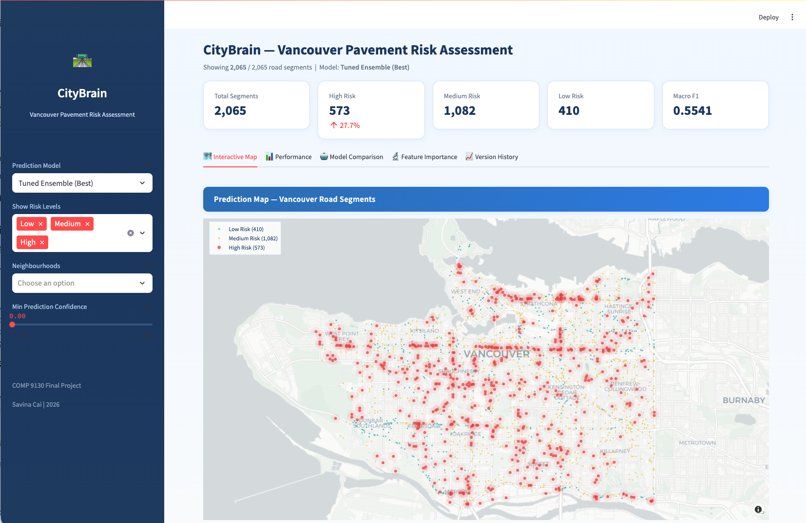

# Vancouver CityBrain — Vancouver Pavement Risk Assessment

<div align="center">

**A multi-model stacking ensemble for 3-class pavement risk classification (Low / Medium / High) using 10 open datasets from the City of Vancouver.**

COMP 9130 Final Project &nbsp;|&nbsp; Savina Cai &nbsp;|&nbsp; 2026


</div>

---

## Dashboard Preview

<div align="center">

<p><i>Interactive Streamlit dashboard — risk map, model comparison, SHAP analysis, version history</i></p>
</div>


---

## Architecture

```
Road Features (12d)        Tabular Features (44d)
       │                          │
  ┌────▼────┐              ┌──────▼──────┐
  │Road-MLP │              │ Tabular-MLP │
  └────┬────┘              └──────┬──────┘
       └──────────┬───────────────┘
            ┌─────▼──────┐
            │CrossAttention│
            │   Fusion    │
            └─────┬──────┘
                  │
   ┌──────────────┼──────────────────┐
   │              │                  │
 Fusion    XGBoost/CatBoost    LightGBM/ExtraTrees
   │              │                  │
   └──────┬───────┴──────────────────┘
    ┌─────▼──────┐
    │  10-Fold   │
    │  Stacking  │ ← XGBoost meta-learner (regularised)
    └─────┬──────┘
    ┌─────▼──────┐
    │ Threshold  │ ← differential evolution
    │  Tuning    │
    └─────┬──────┘
          ▼
   Low / Medium / High
```

---

## Results

| Metric | Value |
|--------|-------|
| **Macro F1** | 0.5446 |
| **Accuracy** | 55.6% |
| **High→Low misclassification** | 7.1% (conservative) |
| **Top SHAP feature** | `sl_risk_7` (spatial lag) |
| **Total improvement** | v1 (0.39) → v15 (0.54), **+39%** |

---

## Project Structure

```
AI-FinalProject/
├── code/
│   ├── EDA/                            # Exploratory data analysis
│   │   ├── CityBrain_InfraEDA.ipynb    
│   │   └── CityBrain_initial_EDA.ipynb
│   ├── Improve_process/        
│   │   └── CityBrain_v{1-13}.ipynb        # Model iteration history
│   └── CityBrain_v_finished.ipynb 
├── webapp/
│   ├── app.py                          # Streamlit dashboard
│   ├── requirements.txt                # Python dependencies
│   └── data/                           # Dashboard CSV data
├── data/                               # Raw datasets (from Drive)
├── figures/                            # Plots & screenshots
└── README.md
```

---

## Quick Start

### 1. Clone & download data

```bash
git clone git@github.com:Ledja22/vancouver-city-brain.git
cd AI-FinalProject
```

Raw datasets are too large for GitHub. Download from Google Drive:

> **[Google Drive — AI-FinalProject](https://drive.google.com/drive/folders/1GaJUk_7bzcHntYOaM2vXbYqX1Sdwq3_h?usp=sharing)**

### 2. Run the model (Colab)

1. Upload the project to Google Drive
2. Open `code/CityBrain_v15_finished.ipynb` in Colab
3. Set runtime to **GPU**
4. Run all cells — training takes ~15 min

### 3. Export dashboard data (Colab)

After training completes, download the generated CSV to `webapp/data/`.

### 4. Launch the dashboard (local)

```bash
cd webapp
pip install -r requirements.txt
streamlit run app.py
```

Open **http://localhost:8501** in your browser.

> **Demo mode:** The dashboard works out of the box with sample data. Replace `webapp/data/` CSVs with real exports for production results.

---

## Datasets

All sourced from [City of Vancouver Open Data Portal](https://opendata.vancouver.ca/):

| Dataset | Records | Role |
|---------|---------|------|
| Pavement Condition | 13K | Target labels |
| Street Intersections | 7K | Road graph |
| Water Mains | 67K | Infrastructure age |
| Sewer System | 40K | Drainage risk |
| Street Trees | 186K | Canopy features |
| Building Permits | 625K | Development density |
| Bikeways | 3.7K | Road usage |
| Truck Routes | 3 | Heavy traffic |
| Snow Routes | 270 | Maintenance priority |
| Manholes & Catch Basins | 81K | Utility density |

---

## License

This project was developed for academic purposes (COMP 9130). All data is from public open data sources.
